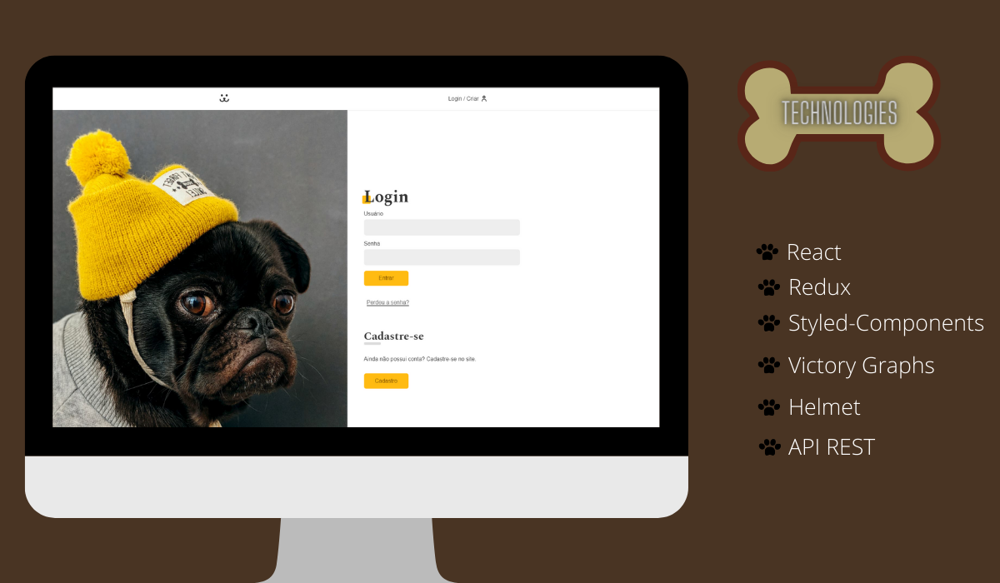

<p align="center">
  <a href="#-stack">Stack</a>&nbsp;&nbsp;&nbsp;|&nbsp;&nbsp;&nbsp;
  <a href="#-roadmap">Roadmap</a>&nbsp;&nbsp;&nbsp;|&nbsp;&nbsp;&nbsp;
  <a href="#-layout">Layout</a>&nbsp;&nbsp;&nbsp;&nbsp;&nbsp;&nbsp;
</p>

<div align="center">
  
</div>

<br>

#### ⚠️ Public API, may contain random images and comments. Information is deleted from the API after a period of time

## ✨ Stack

- [ ] React
- [ ] Redux
- [ ] Styled-Components
- [ ] Lib Victory Graphs
- [ ] Helmet
- [ ] API REST

## 💻 Roadmap

From your terminal navigate to the project folder and run:

```cl
  npm install
  npm start
```

## 🔖 Layout

## My account

Link acess: https://insta-dogs-six.vercel.app/

<div>
  
</div>

---

## Modal / Comments

<div>
  
</div>

---

## Photo Post / Preview

<div>
  
</div>

---

## Stats / Graphs

<div>
  
</div>

---

## 📲 Contact

<div>
  <a href="https://www.linkedin.com/in/gianmanzo/" target="_blank">
      </a>
      
   <a href="mailto:ggianmanzo@gmail.com" target="_blank">
      </a>
      
   <a href="https://api.whatsapp.com/send?phone=+5519989873771&text=Ola" target="_blank">
      </a>
      
   <a href="https://www.instagram.com/gianmanzoo/" target="_blank">
      </a>
</div>

---

Project created by Origamid and developed by Gian Manzo
